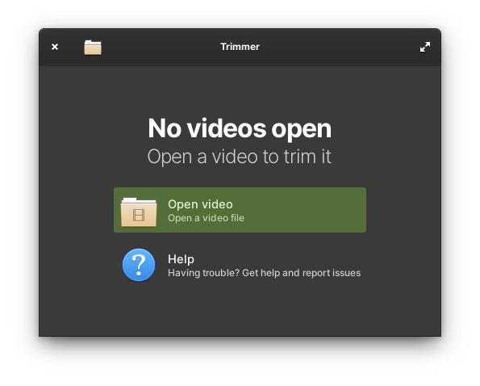
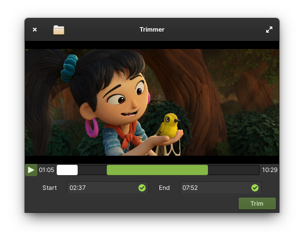

# trimmer
A video trimming utility designed for elementary OS.

**trimmer is still a work in progress**




# Building, testing and installation
You'll need the following dependencies
- meson
- libgranite-dev
- valac
- libclutter-gst-3.0-dev
- libclutter-gtk-1.0-dev

Run `meson` to configure the build environment and then use `ninja` to build
```
meson build
cd build
ninja
```
# Credits
Directly inspired by Ivan Molodetskikh's [Video Trimmer](https://gitlab.gnome.org/YaLTeR/video-trimmer) for GNOME.
