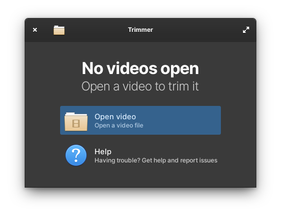
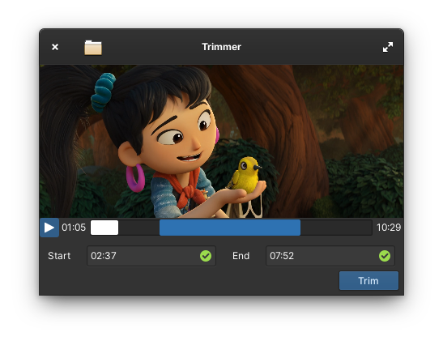
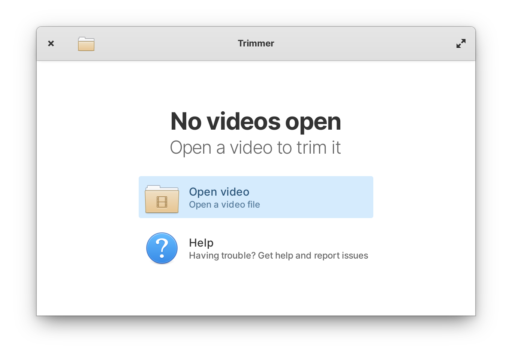
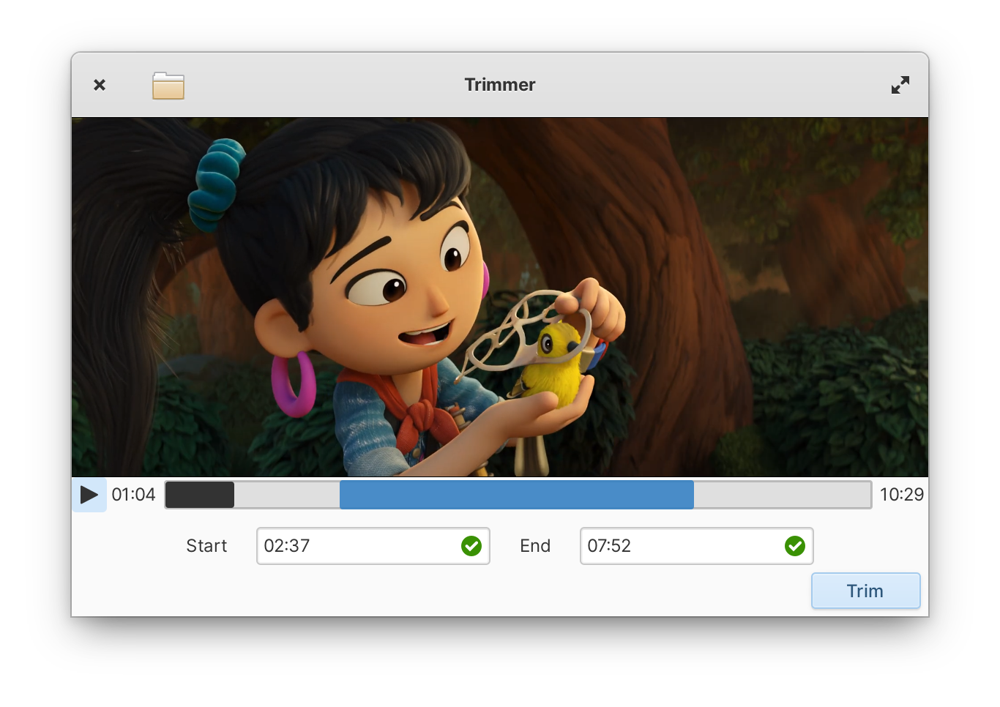

<div align="center">
  <div align="center">
    
  </div>
  <h1 align="center">Trimmer</h1>
  <div align="center">A video trimming utility for elementary OS. </div>
</div>
<p align="center">
  <a href="https://appcenter.elementary.io/com.github.phoneybadger.trimmer"></a>
</p>

## Usage

Quickly trim videos using start and end timestamps. Trimmer doesn't re-encode any videos so the process should be very fast.

## Screenshots

|         |         |
|-----------------------------------------------------------------------------------------|---------------------------------------------------------------------------------------|
|  |  |

## Installation
### On Elementary OS
On elementary OS you can get Trimmer from the appcenter

### On other distros
Trimmer is developed targetting and tested on elementary OS. However you can
always install Trimmer as flatpak on any distro from the elementary flatpak
repository.
```
flatpak install https://flatpak.elementary.io/repo/appstream/com.github.phoneybadger.trimmer.flatpakref
```
If you're using GNOME you can also consider using Ivan Molodetskikh's 
[Video Trimmer](https://gitlab.gnome.org/YaLTeR/video-trimmer) which this app
was directly  inspired by.

## Building and running

Download or clone the repo
```
git clone https://github.com/phoneybadger/trimmer.git
cd trimmer
```

#### Build with Flatpak
Run `flatpak-builder` to build and install as a flatpak for the current user
```
flatpak-builder build com.github.phoneybadger.trimmer.yml --user --install --force-clean
```
the program should now be installed and can be launched using
```
flatpak run com.github.phoneybadger.trimmer
```

#### Without Flatpak
You'll need the following dependencies
- valac
- meson
- libgtk3-dev
- libgranite-dev
- libclutter-gst-3.0-dev
- libclutter-gtk-1.0-dev
- libgstreamer1.0-dev
- ffmpeg

Run `meson` to configure the build environment and then use `ninja` to build
```
meson build --prefix=/usr
cd build
ninja
```
To install use `ninja install`, then execute with `com.github.phoneybadger.trimmer`
```
sudo ninja install
com.github.phoneybadger.trimmer
```

## Contributing
Contributions are always welcome. You can raise an issue if you come across a bug
and feel free to send in pull requests with features or bug fixes.

### Code
The code generally follows the [elementary code style guidelines](https://docs.elementary.io/develop/writing-apps/code-style).
The project uses [vala-lint](https://github.com/vala-lang/vala-lint) to check for
code style issues.

### Translations
Generate `.pot` translation template file using `po/LINGUAS` and `po/POTFILES`.
```
ninja com.github.phoneybadger.trimmer-pot
```
then use the template file to generate/update `.po` files for each of the 
languages listed in `LINGUAS`
```
ninja com.github.phoneybadger.trimmer-update-po
```

## Credits
- Directly inspired by Ivan Molodetskikh's [Video Trimmer](https://gitlab.gnome.org/YaLTeR/video-trimmer) for GNOME.
- Video used in screenshots is Blender open movie [Sprite fright](https://studio.blender.org/films/sprite-fright/).
- [Resizer](https://github.com/peteruithoven/resizer) and [Videos](https://github.com/elementary/videos) for code reference.
- Article on [Vala reactive programming](https://dev.to/igordsm/vala-reactive-programming-2pf4) by Igor Montagner.
